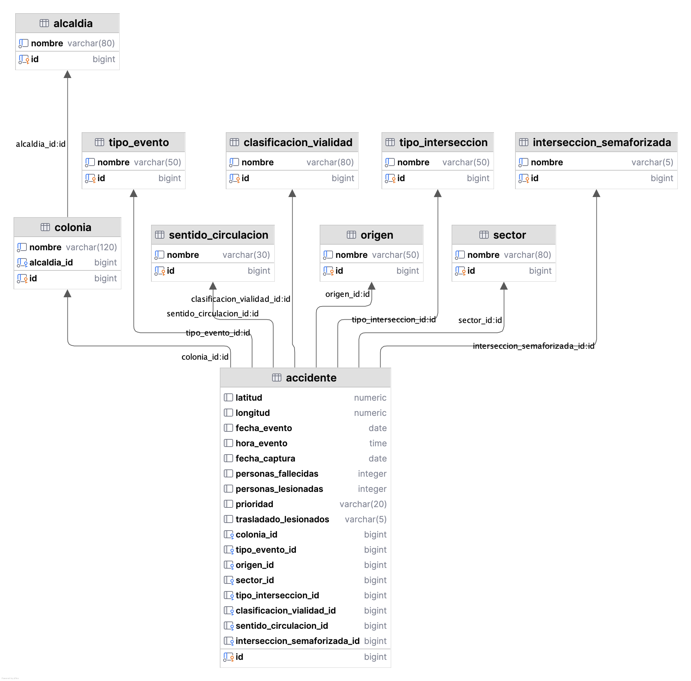

# Proyecto BD: Accidentes de Tránsito en la CDMX

## Integrantes

- Alexis Cuevas — CU: 219050 — GitHub: https://github.com/alexiscuevasheras  
- Ben Zimbron — CU: 212907 — GitHub: https://github.com/benbenutoravioli
- Dominique Ontiveros — CU: 220552 — GitHub: https://github.com/Domdimad0m 
- Fernando Gutiérrez — CU:  216761 — GitHub: https://github.com/ferdgm
- Juan Pablo Montiel — CU: 220172 — GitHub: https://github.com/joldot  

---

## Introducción

Este proyecto utiliza un conjunto de datos que contiene información detallada sobre incidentes de tránsito ocurridos en la Ciudad de Méxic desde 2018 hasta 2024. Cada registro describe un siniestro vial e incluye información sobre su ubicación geográfica, características del evento, condiciones del entorno, vehículos involucrados y consecuencias humanas.

El análisis de estos datos permite identificar patrones de accidentalidad urbana y contribuir al diseño de estrategias para mejorar la seguridad vial en la ciudad.

En particular, este proyecto busca:

- Identificar puntos críticos con alta incidencia de accidentes  
- Analizar patrones temporales (horas y días con mayor frecuencia)  
- Detectar factores de riesgo predominantes por alcaldía  

Estos resultados pueden apoyar la toma de decisiones en:

- Planeación de infraestructura vial  
- Asignación de recursos de emergencia  
- Diseño de campañas de concientización  

### Consideraciones éticas

El uso de este conjunto de datos implica ciertas consideraciones éticas. Aunque no contiene información personal directa, existe el riesgo de identificación indirecta en casos específicos. Además, el análisis podría contribuir a la estigmatización de ciertas zonas con alta incidencia de accidentes o ser utilizado por terceros (por ejemplo, aseguradoras) para tomar decisiones que afecten a la población.

Adicionalmente, es importante considerar el sesgo de exclusión presente en los datos. Al provenir exclusivamente de reportes de emergencia y registros policiales, el conjunto de datos sub-representa aquellas zonas o poblaciones donde los incidentes no se reportan, ya sea por falta de acceso a servicios de emergencia, desconfianza hacia las instituciones o porque los involucrados resuelven el incidente sin intervención oficial. Esto implica que las conclusiones derivadas del análisis podrían invisibilizar necesidades reales de infraestructura vial o atención en zonas con bajo reporte, perpetuando la concentración de recursos hacia las áreas que ya cuentan con mayor cobertura institucional.

Por ello, es importante interpretar los resultados con responsabilidad y dentro de un contexto adecuado, con el conocimiento a priori de que la ausencia de datos no equivale a la ausencia de riesgo.

---

## Fuente de datos

Los datos utilizados en este proyecto provienen del Portal de Datos Abiertos de la Ciudad de México y son generados por la Secretaría de Seguridad Ciudadana (SSC) en colaboración con el C5 (Centro de Comando, Control, Cómputo, Comunicaciones y Contacto Ciudadano).

Estos datos se recolectan a partir de reportes de emergencia y registros policiales, y se publican con fines de transparencia y análisis estadístico. Su frecuencia de actualización es mensual, aunque la última actualización disponible fue publicada el 23 de febrero de 2024.

Se pueden consultar en el siguiente enlace:

https://datos.cdmx.gob.mx/dataset/hechos-de-transito-reportados-por-ssc-base-ampliada-no-comparativa/resource/0555dd20-d921-4f76-aa8c-1a0689f48bce

Las instrucciones de replicación del proyecto asumen que los datos se encuentran almacenados en formato `CSV` bajo el nombre: `./data/raw_data.csv`

---

## Descripción del conjunto de datos

El conjunto de datos contiene aproximadamente 134,079 registros anuales, con 26 atributos que describen cada incidente.

|Atributo|Tipo|Descripción|
|--------|-----|----------|
|latitud|Numérico|Coordenada de latitud del incidente|
|longitud|Numérico|Coordenada de longitud del incidente|
|personas_fallecidas|Numérico|Número de personas fallecidas en el incidente|
|personas_lesionadas|Numérico|Número de personas lesionadas en el incidente|
|zona_vial|Categórico|Zona vial donde ocurrió el incidente (valores del 1 al 6)|
|tipo_evento|Categórico|Clasificación del accidente (choque, atropellado, derrapado, volcadura, caída de ciclista, caída de pasajero)|
|tipo_de_interseccion|Categórico|Geometría de la intersección donde ocurrió el incidente (cruz, Y, glorieta, curva, desnivel, etc.)|
|interseccion_semaforizada|Categórico|Indica si la intersección cuenta con semáforo (SI/NO)|
|clasificacion_de_la_vialidad|Categórico|Tipo de vialidad donde ocurrió el incidente (vía primaria, vía secundaria, eje vial, acceso carretero, etc.)|
|sentido_de_circulacion|Categórico|Sentido cardinal de circulación de la vialidad donde ocurrió el incidente|
|dia|Categórico|Día de la semana en que ocurrió el incidente|
|prioridad|Categórico|Nivel de prioridad asignado al incidente (alta, media, baja)|
|origen|Categórico|Canal por el cual se reportó el incidente (llamada 911, radio, cámara, botón de auxilio, etc.)|
|trasladado_lesionados|Categórico|Indica si los lesionados fueron trasladados a una unidad médica (SI/NO)|
|colonia|Categórico|Colonia donde ocurrió el incidente|
|alcaldia|Categórico|Alcaldía de la Ciudad de México donde ocurrió el incidente|
|sector|Categórico|Sector policial que atendió el incidente|
|folio|Texto|Identificador alfanumérico asignado al reporte del incidente|
|unidad_a_cargo|Texto|Matrícula de la unidad policial que atendió el incidente|
|unidad_medica_de_apoyo|Texto|Identificador de la unidad médica que brindó apoyo|
|matricula_unidad_medica|Texto|Matrícula de la unidad médica que atendió el incidente|
|punto_1|Texto|Nombre de la primera vialidad de referencia del incidente|
|punto_2|Texto|Nombre de la segunda vialidad de referencia|
|fecha_evento|Temporal|Fecha en que ocurrió el incidente|
|hora_evento|Temporal|Hora en que ocurrió el incidente|
|fecha_captura|Temporal|Fecha en que se capturó el registro en el sistema|

## Documentación
---
### Estructura del repositorio
El proyecto sigue una estructura modular para facilitar la reproducibilidad del pipeline de datos:

```
├── README.md                                         <- Documentación del proyecto (reporte escrito)
├── data
│   ├── raw_data.csv                                  <- Datos en formato CSV como vienen de la fuente original
│   ├── colonias_iecm.shp/.shx/.dbf/.prj             <- Shapefile de colonias de la CDMX (IECM)
│   └── *.png                                         <- Mapas generados por el script 05
│
├── pipeline_scripts                                  <- Scripts para ejecución del pipeline de datos
│   ├── 01_raw_data_schema_creation_and_load.sql      <- Carga inicial (actividad B)
│   ├── 02_data_cleaning.sql                          <- Limpieza de datos (actividad C)
│   ├── 03_data_normalization.sql                     <- Normalización de relaciones (actividad D)
│   ├── 04_analytical_attributes_creation.sql         <- Atributos analíticos y funciones de ventana (actividad E)
│   ├── 05_georeferenced_maps.py                      <- Script Python de mapas (actividad E)
│   └── 05_georeferenced_maps.ipynb                   <- Notebook con mapas ya renderizados (actividad E)
│
└── exploration_queries                               <- Scripts de SQL para exploración de datos
    └── 01_data_pre_analytics.sql                     <- Consultas de exploración de datos en bruto (soporte de actividad B)
```

### Requerimientos para replicación del proyecto

Para replicar este proyecto es necesario:

1. Descargar los datos en bruto de acuerdo con la sección de **Fuente de datos**.
2. Contar con PostgreSQL 16 o superior instalado.
3. Contar con la extensión PostGIS instalada (requerida por el script 04 para georreferenciación). Instrucciones de instalación: https://postgis.net/documentation/getting_started/
4. Crear una base de datos exclusiva para el proyecto.
5. Contar con acceso a una terminal con `psql` o un cliente compatible (por ejemplo, TablePlus).
6. Ejecutar los comandos desde la raíz del repositorio.

## Carga inicial

En primer lugar, se debe crear una base de datos exclusiva para este proyecto. Para ello, ejecutar el siguiente comando en `psql`:

```{psql}
CREATE DATABASE vialcdmx;
```

Posteriormente, debemos conectarnos a dicha base de datos empleado:

```{psql}
\c vialcdmx
```

Finalmente, para cargar los datos en bruto se debe ejecutar el siguiente comando en una sesión de línea de comandos `psql`:

```{psql}
\i pipeline_scripts/01_raw_data_schema_creation_and_load.sql
```

### Hallazgos del análisis preliminar

El script de exploración se encuentra en `exploration_queries/01_data_pre_analytics.sql`. A continuación se resumen los hallazgos principales:

**Registros totales:** 134,079 tuplas cargadas exitosamente.

**Rango temporal:** Los datos abarcan del 1 de enero de 2018 al 31 de diciembre de 2023.

**Valores únicos en columnas relevantes:**

| Columna | Valores únicos |
|---------|---------------|
| folio | 126,472 |
| colonia | 4,250 |
| sector | 237 |
| origen | 29 |
| alcaldia | 18 |
| tipo_evento | 6 |

**Folio como posible llave:** El atributo 'folio' no es candidato a llave primaria ya que existen 7,288 registros con valor "SD" (sin dato) y algunos folios repetidos (hasta 5 veces).

**Estadísticas numéricas:**

| Atributo | Mínimo | Máximo | Promedio |
|----------|--------|--------|----------|
| personas_fallecidas | 0 | 10 | 0.0195 |
| personas_lesionadas | 0 | 25 | 1.1634 |

No se encontraron valores negativos en personas fallecidas ni lesionadas.

**Distribución por tipo de evento:**

| Tipo evento | Total |
|-------------|-------|
| CHOQUE | 76,907 |
| DERRAPADO | 24,940 |
| ATROPELLADO | 24,844 |
| CAIDA DE CICLISTA | 3,151 |
| VOLCADURA | 2,296 |
| CAIDA DE PASAJERO | 1,941 |

**Distribución por alcaldía (top 5):**

| Alcaldía | Total |
|----------|-------|
| CUAUHTEMOC | 19,669 |
| IZTAPALAPA | 19,262 |
| GUSTAVO A MADERO | 14,762 |
| BENITO JUAREZ | 10,753 |
| VENUSTIANO CARRANZA | 10,055 |

**Valores nulos relevantes:**

| Columna | Nulos |
|---------|-------|
| matricula_unidad_medica | 82,187 |
| hora_evento | 5,009 |
| latitud | 7 |
| longitud | 4 |
| trasladado_lesionados | 3 |
| unidad_medica_de_apoyo | 2 |
| folio | 1 |

**Colonias con mayor incidencia (top 10):**

| Colonia | Total |
|---------|-------|
| CENTRO | 3,719 |
| MORELOS | 1,432 |
| DOCTORES | 1,424 |
| AGRICOLA ORIENTAL | 1,419 |
| JUAREZ | 1,217 |
| ROMA NTE | 1,176 |
| GUERRERO | 1,134 |
| OBRERA | 1,014 |
| AGRICOLA PANTITLAN | 877 |
| NARVARTE PTE | 858 |

**Distribución por prioridad:**

| Prioridad | Total |
|-----------|-------|
| BAJA | 103,200 |
| MEDIA | 28,125 |
| ALTA | 2,754 |

**Origen del reporte (top 5):**

| Origen | Total |
|--------|-------|
| LLAMADA DEL 911 | 65,167 |
| (vacío) | 35,043 |
| RADIO | 14,680 |
| 911 CDMX | 10,769 |
| BOTON DE AUXILIO | 4,628 |

**Inconsistencias detectadas en atributos categóricos:**

- En `dia` se encontraron 19 valores distintos cuando solo debería haber 7. Existen errores tipográficos como "Mábado", "Siérco", "S<c3>érco" y valores que no corresponden a días como "Ruben leñero", "Taxqueña", "Coruña" y "1° de mayo".
- En `alcaldia` aparecen 18 valores cuando la CDMX tiene 16 alcaldías. Se detectó "AV INSURGENTES" (que no es una alcaldía) y una duplicación por diferencia en puntuación: "GUSTAVO A MADERO" vs "GUSTAVO A. MADERO".
- En `origen` se detectó duplicación por diferencia de tilde: "BOTON DE AUXILIO" vs "BOTÓN DE AUXILIO". Además, 35,043 registros (26%) no tienen origen registrado.
- Se encontraron 9,221 registros donde `fecha_captura` es anterior a `fecha_evento`, lo cual es lógicamente imposible. El patrón sugiere una inversión de día y mes en el parseo de las fechas (formato DD/MM interpretado como MM/DD).
- No se encontraron filas completamente duplicadas al comparar por fecha, hora, tipo de evento, folio, latitud, longitud y alcaldía.

## Limpieza de datos

El proceso de limpieza sigue una metodología de refresh destructivo, por lo que cada vez que se corra se generará desde cero el esquema y las tablas correspondientes. Para ejecutar el proceso de limpieza de datos se debe ejecutar el siguiente 
comando en `psql`:

```{psql}
\i pipeline_scripts/02_data_cleaning.sql
```

**Desglose de limpieza de datos:**
| Atributo(s) | Operación(es) | Justificación | Observación  |
|-------------|---------------|---------------|--------------|
| `fecha_evento`, `fecha_captura` | `UPDATE` | Se detectaron 9,221 registros donde `fecha_captura < fecha_evento`, lo cual es lógicamente imposible (no se puede capturar un evento antes de que ocurra). El patrón (no hay ninguna ocurrencia donde día sea mayor a 12) sugiere intercambiar día/mes en el parseo original. | Se corrigió la inversión día/mes, se arregló el año incorrecto en un subconjunto de tuplas y se intercambiaron las fechas en los casos donde ambas estaban invertidas. |
| `dia`  | `DROP COLUMN`  | El día de la semana ya está implícito en `fecha_evento`. Mantenerlo introduce redundancia y riesgo de inconsistencia. | Si llega a ser necesario se extraerá de `fecha_evento`. |
|`punto_1`, `punto_2` | `DROP COLUMN`| Hay 18866 valores únicos de mala calidad. La información que tenemos de `latitud` y `origen` es suficiente. | |
| `tipo_de_interseccion` | `UPDATE`, `RENAME COLUMN` | Se encontraron valores inconsistentes: "AJUSCO" (verificado en Maps como intersección tipo T) y "CRUZO" (tipo de "CRUZ"), se renombró a `intersección` para facilidad de manipulación. | Se corrigieron los valores erróneos a sus equivalentes correctos.|
| `clasificacion_de_la_vialidad` | `UPDATE`, `RENAME COLUMN` | Existía duplicación por diferencia de espaciado: "EJEVIAL" vs "EJE VIAL", se renombró a `vialidad` para facilidad de manipulación.  | Se homologó a "EJE VIAL". |
| `interseccion_semaforizada` | `UPDATE` | Existían valores "N" que debían ser "NO" para mantener consistencia con el dominio SI/NO del atributo. | Se homologó "N" a "NO". |
| `sentido_de_circulacion` | `UPDATE` |  Se encontraron typos ("P O" en vez de "P-O") y valores ambiguos ("N", "NO", "PO") que no representan sentidos cardinales válidos. | Corrección de escritura y nullificación de valores ambiguos. |
| `alcaldia` | `UPDATE` | Se detectaron 18 valores únicos cuando la CDMX solo tiene 16 alcaldías. "GUSTAVO A. MADERO" duplicaba a "GUSTAVO A MADERO" y "AV INSURGENTES" no es una alcaldía (la colonia asociada pertenece a Cuauhtémoc). | Se homologaron ambos casos a sus valores correctos. |
| `origen` | `UPDATE` | Se encontraron inconsistencias por tildes ("POLICÍA"/"POLICIA", "CÁMARA"/"CAMARA", "BOTÓN"/"BOTON"), variantes de 911 dispersas, y valores sin sentido como "SABADO". | Se homologaron variantes con tilde, se agruparon categorías de 911 y botón de auxilio, se nullearon valores sin sentido y se agruparon categorías con menos de 10 ocurrencias en "OTROS". |
| `sector` | `UPDATE` | Se encontraron múltiples errores ortográficos en nombres de sectores policiales ("TLALTELOLCO", "PALTEROS", "CALVERIA") y variantes de escritura para un mismo sector (9 variantes de "ABASTO REFORMA"). | Se corrigieron errores ortográficos evidentes. Categorías raras o de baja frecuencia se conservaron para evitar agrupaciones artificiales. Se nulleó "SD" (sin dato). |
| `matricula_unidad_medica` | `DROP COLUMN` | 82,187 nulos de 134,079 registros y no aporta valor analítico al estudio de patrones de accidentalidad. | Eliminada. |
| `folio` | `DROP COLUMN` | No funciona como llave primaria (7,288 registros con valor "SD" y folios repetidos). Es un identificador administrativo que no aporta al análisis de patrones de accidentalidad. | Eliminado. |
| `zona_vial` | `DROP COLUMN` | Entero del 1 al 6 sin documentación oficial sobre su significado. No es posible analizar ni interpretar un atributo cuya semántica se desconoce. | Eliminado. |

**Atributos no limpiados (decisión consciente):**

Los siguientes atributos presentan inconsistencias pero se decidió no modificarlos por el riesgo de introducir agrupaciones incorrectas:

| Atributo | Justificación de no intervención |
|----------|----------------------------------|
| `colonia` | Presenta más de 4,250 valores únicos con variaciones sutiles de escritura (abreviaciones, tildes, espacios). La homologación automatizada requeriría una fuente externa de referencia y una agrupación manual podría llevar a pérdida de información. |
| `unidad_a_cargo` | Contiene matrículas de unidades policiales con abreviaciones internas no documentadas. Sin un catálogo oficial, cualquier modificación podría alterar información. |
| `unidad_medica_de_apoyo` | Presenta múltiples variantes de instituciones (CRUZ ROJA, ERUM) combinadas con identificadores específicos. |

## Normalización

La normalización se realiza también mediante la estrategia de refresh destructivo. Para ejecutar el proceso de
normalización se puede emplear el siguiente comando en `psql`:

```{psql}
\i pipeline_scripts/03_data_normalization.sql
```


## Normalización del dataset de incidentes viales (CDMX)

El proceso de normalización transforma el conjunto de datos original en un modelo relacional estructurado, eliminando redundancia y asegurando consistencia mediante la separación de atributos categóricos en catálogos independientes.
Esta es una normalización intuitiva, por lo que no forzosamente está en FNBC o 4FN.

---

## Estructura general del modelo

El modelo se organiza en:

### Entidad central (hechos)
- `accidente`

**Justificación:**
Representa el evento principal del sistema (incidente vial). Se mantiene como tabla central porque concentra las variables cuantitativas y temporales del fenómeno. Todas las demás entidades se relacionan con esta tabla.

---

### Dimensiones geográficas
- `alcaldia`
- `colonia`

**Justificación:**
Se separan debido a que representan una estructura jerárquica y altamente repetitiva dentro de los registros.
- Permite análisis geoespacial consistente.
- Evita la duplicación de nombres de ubicación en cada incidente.
- Una alcaldía puede contener múltiples colonias (relación 1:N). Se implementa mediante:
  ```{psql}
  AND c.alcaldia_id = a.id
  ```

---

### Relaciones respecto a la clasificación del evento
- `tipo_evento`
- `tipo_interseccion`
- `clasificacion_vialidad`
- `sentido_circulacion`

**Justificación:**
Se modelan como catálogos independientes porque:
- Tienen un conjunto limitado de valores posibles.
- Se repiten constantemente en los registros.
- Separarlos evita inconsistencias de escritura y facilita la estandarización del análisis.

---

### Catálogos operativos
- `origen`
- `sector`

**Justificación:**
Estos atributos describen la operación del sistema de atención del incidente.
- Representan entidades administrativas o de respuesta.
- Su normalización permite mantener consistencia en la captura de datos.
- Facilita análisis sobre eficiencia y cobertura operativa.

---

## Dependencias funcionales y multivaluadas

A continuación se enlistan las dependencias funcionales (DF) y multivaluadas (DMV) no triviales identificadas en la relación universal `clean.datos_transitocdmx` (después de la etapa de limpieza).

**Dependencias funcionales no triviales:**

| # | Dependencia | Análisis |
|---|-------------|------------|
| 1 | `id → fecha_evento, hora_evento, tipo_evento, fecha_captura, latitud, longitud, colonia, alcaldia, sector, unidad_a_cargo, tipo_de_interseccion, interseccion_semaforizada, clasificacion_de_la_vialidad, sentido_de_circulacion, prioridad, origen, unidad_medica_de_apoyo, trasladado_lesionados, personas_fallecidas, personas_lesionadas` | La llave, al haber sido generada artificialmente, determina todos los atributos del registro. |
| 2 | `colonia → alcaldia` | Una colonia pertenece a exactamente una alcaldía. Por lo que cada vez que se repite una colonia, se repite también la alcaldía, lo cual es redundante. |

**Violación a FNBC:**

- La DF #2 (`colonia → alcaldia`) viola FNBC porque `colonia` no es superllave de la relación. Esto justifica la descomposición en las tablas `alcaldia` y `colonia` (con `alcaldia_id` como FK en `colonia`).

---

## ERD



En este diseño las llaves foráneas están en las flechas y no en la caja de cada tabla, pero forman parte de las tabla.

---
## Georreferenciación (parte E)

El script `04_analytical_attributes_creation.sql` crea la extensión PostGIS y agrega una columna de geometría (`geom`) a la tabla `normalization.accidente` a partir de las coordenadas de latitud y longitud. Esto permite realizar análisis espacial sobre los puntos de incidentes.

La georreferenciación se realiza en la etapa de análisis (y no en limpieza o normalización) porque es un atributo adicional que enriquece los datos para su análisis, no una corrección ni una descomposición estructural.
Previo a la ejecución del script, se debe cargar el shapefile de colonias para poder realizar cruces espaciales (mapas coropléticos). Desde la terminal hay que correr:

```{bash}
shp2pgsql -s 4326 -I data/colonias_iecm.shp clean.colonia_geometria | psql -d vialcdmx
```

Aquí, 4326 es el sistema de coordenadas. Este comando crea una tabla nueva `clean.colonia_geometria` con los datos del shapefile en data.


Para ejecutar el script de atributos analíticos:
```{psql}
\i pipeline_scripts/04_analytical_attributes_creation.sql
```

### Atributos analíticos y funciones de ventana

El script 04 contiene tres bloques:

**1. Queries descriptivas** — Análisis de frecuencia y groupby:
- Puntos críticos (lat/lon con más accidentes)
- Distribución por hora, día de la semana, alcaldía
- Factores de riesgo por alcaldía (vialidad × intersección × semáforo)
- Tipos de accidente más frecuentes
- Colonias con más lesionados
- Intersecciones más peligrosas por fallecidos
- Tiempo entre accidente y captura (máximo, mínimo, promedio)

**2. Funciones de ventana:**


- Ranking de alcaldías por total de accidentes
- Acumulado mensual de accidentes por mes 
- Promedio por alcaldía vs individual (comparación de cada accidente contra el promedio de su alcaldía)
- Cambio de accidentes entre horas consecutivas 
- Clasificar colonias en 4 grupos (cuartiles) de riesgo
- Ranking de tipos de evento dentro de cada alcaldía |

**3. Queries para georreferenciación:**
- Coordenadas de todos los accidentes (mapa de calor)
- Tasa de letalidad por colonia (mapa coropético)
- Top 20 intersecciones no semaforizadas más peligrosas (petición de semaforización)
- Accidentes diurnos vs nocturnos (comparativo)
- Intersecciones no semaforizadas con accidentes nocturnos

---

### Visualización georreferenciada

El script `05_georeferenced_maps.py` genera 5 mapas a partir de las queries del script 04, utilizando el shapefile de colonias como base geográfica.

**Dependencias Python:**
```bash
pip install geopandas matplotlib contextily sqlalchemy psycopg2-binary
```

**Ejecución (desde `pipeline_scripts/`):**
```bash
python 05_georeferenced_maps.py
```

También existe el notebook `05_georeferenced_maps.ipynb` que contiene el mismo código dividido en celdas, con las gráficas ya renderizadas (una vez ejecutado) para revisión directa sin necesidad de correr el pipeline.

**Mapas generados:**

| # | Archivo | Descripción |
|---|---------|-------------|
| 1 | `mapa_calor_accidentes.png` | Densidad de accidentes como puntos superpuestos sobre basemap oscuro |
| 2 | `mapa_coropletico_letalidad.png` | Colonias coloreadas por tasa de letalidad (fallecidos/accidentes, mín. 5 accidentes) |
| 3 | `mapa_peticion_semaforos.png` | Top 20 intersecciones sin semáforo con más accidentes, con etiquetas |
| 4 | `mapa_dia_vs_noche.png` | Panel comparativo: accidentes de día (7–19h) vs noche (19–7h), con intersecciones nocturnas sin semáforo resaltadas |

Cada mapa incluye como comentario en el código la consulta SQL equivalente que genera los datos utilizados.

**Nota:** El script asume una conexión PostgreSQL en `localhost:5432` con base de datos `vialcdmx` y usuario local sin contraseña. Podría ser necesario ajustar el Engine, pero para que no sea necesario correr el archivo python se sube un cuaderno .ipynb con los dfs creados y gráficas generadas.

---

### Resultados del pipeline de mapas

Al ejecutar el script 05, se obtuvieron los siguientes resultados:

**Mapa 1 — Densidad de accidentes:** Se graficaron las coordenadas de todos los accidentes con geolocalización disponible. La concentración más alta se observa en el centro de la ciudad (alcaldías Cuauhtémoc, Benito Juárez y Venustiano Carranza).

**Mapa 2 — Tasa de letalidad por colonia:** Se identificaron colonias con tasas de letalidad superiores al promedio, particularmente en la periferia (Tlalpan, Xochimilco, Milpa Alta) donde la infraestructura vial es menos desarrollada o hay carreteras federales (México-Cuernavaca en gran parte de Tlalpan).

**Mapa 3 — Petición de semaforización (Top 20 intersecciones no semaforizadas):**

| Colonia | Alcaldía | Tipo | Accidentes | Lesionados |
|---------|----------|------|-----------|------------|
| San Andrés Totoltepec | Tlalpan | T | 17 | 31 |
| San Miguel Xicalco | Tlalpan | Cruz | 17 | 21 |
| Narvarte Pte | Benito Juárez | Cruz | 17 | 23 |
| San Andrés Totoltepec | Tlalpan | Recta | 16 | 22 |
| Ajusco | Coyoacán | Cruz | 16 | 18 |
| Agrícola Pantitlán | Iztacalco | Recta | 15 | 21 |

Tlalpan concentra 5 de las 20 intersecciones más peligrosas sin semáforo.

**Mapa 4 — Tiempo de respuesta:** Se observa variabilidad en el tiempo promedio entre la ocurrencia del accidente y su captura en el sistema, con colonias periféricas tendiendo a tiempos mayores.

**Mapa 5 — Día vs Noche:**
- Accidentes diurnos (7:00–18:59): 80,789
- Accidentes nocturnos (19:00–6:59): 48,270
- El 37% de los accidentes ocurren de noche, con las intersecciones nocturnas sin semáforo más peligrosas ubicadas en San Pedro Mártir (Tlalpan, 8 acc.), Ajusco (Coyoacán, 6 acc.) y Agrícola Pantitlán (Iztacalco, 6 acc.).

